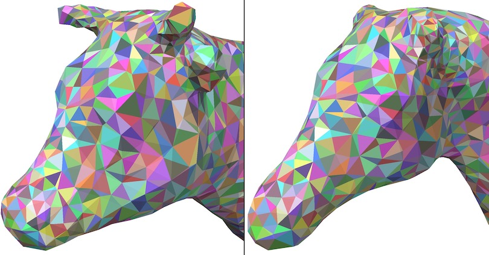
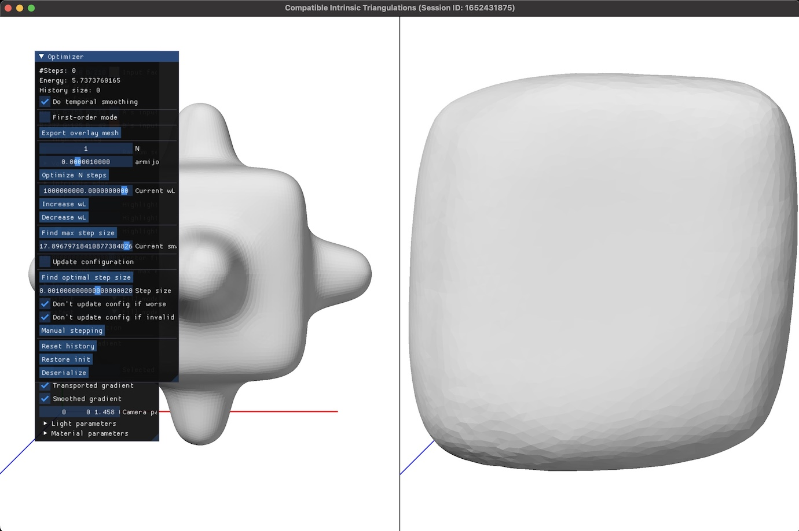

# Compatible Intrinsic Triangulations (SIGGRAPH 2022)

This is a reference implementation of the following publication:

    Compatible Intrinsic Triangulations
    Kenshi Takayama
    ACM Transactions on Graphics 41(4), Article No. 57 (August 2022)
    https://doi.org/10.1145/3528223.3530175

## Building

See [build.yml](.github/workflows/build.yml) for steps to build the executable.

## Usage

### Overview

The build process generates a few executables under `<BUILD_DIR>/bin/`, and `cit_demo` is the main executable implementing the CIT algorithm.

The executable expects the two input triangle meshes of the same surface genus, `A` and `B`, to be placed in a common directory (called *data directory*) and be named as either `A-orig.obj, B-orig.obj` or `A-orig-refined.obj, B-orig-refined.obj`.
The executable takes as input the vertex images from A to B and from B to A as `AtoB.txt` and `BtoA.txt`.
These vertex images can be generated using https://github.com/kenshi84/cit-hot and https://github.com/kenshi84/seamlesssurfmap for genus zero and high genus surfaces, respectively.

With the required files in place, run the following command:

    cit_demo --dataDir /path/to/data/directory --interactive

(With `--dataDir` omitted, the data directory is set to the current directory.)

This opens up an interactive OpenGL window where you can perform various kind of optimization operations as well as inspect various kind of information (e.g., individual compatible edges/faces).

While the above interactive mode is useful for debugging, you can let the executable perform optimization from the start without creating the OpenGL window, by simply not passing the `--interactive` flag.

The executable generates a directory named `results` under the data directory, and within that directory, generates a log file named `<SESSION_ID>.log` where `<SESSION_ID>` is just a number representing the time since the epoch in seconds at launch, as well as a directory `<SESSION_ID>` under which all the intermediate files during optimization are written.

TODO...

### Stopping / resuming optimization using serialization

TODO...

### Extracting overlay mesh

TODO...

### Details on the interactive mode

TODO...
